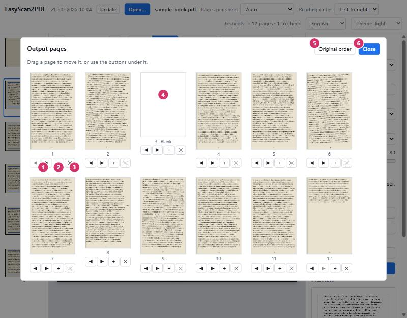

# EasyScan2PDF

Turn scanned documents — typically two book pages per landscape sheet — into a
clean PDF with one page per sheet.

## ▶ [Open EasyScan2PDF](https://jesusjballesteros.github.io/EasyScan2PDF/)

No downloads, no set up: directly in your browser.

**Your documents stay on your device.** The app works entirely inside the
browser, makes no network requests with your files, and keeps working offline.

## Install it as an app

Installing gives EasyScan2PDF its own window and icon, and lets it run without
an internet connection.

| Device | How |
|---|---|
| **Windows, macOS, Linux** — Chrome, Edge, Brave | Open the link above and press **Install app** at the top right of the app (or the install icon in the address bar). |
| **Android** — Chrome | Open the link, then browser menu **⋮ → Add to Home screen → Install**. |
| **iPhone, iPad** — Safari | Open the link, then **Share → Add to Home Screen**. |
| **Firefox** | Installation is not available; use the app in a tab — it works the same. |

Once installed on a computer you can also right-click a PDF and choose
*Open with → EasyScan2PDF*.

---

# User's manual

## 1. The screen


| # | Part | What it is for |
|---|---|---|
| 1 | **Open…** | Choose a scanned PDF. You can also drop the file anywhere on the window. JPEG and PNG scans work too: select all the images at once and each becomes one sheet, in file-name order. |
| 2 | **Version and Update** | The version number and release date of the copy you are running. **Update** downloads the newest version of the app and reloads it — see [Is my copy up to date?](#is-my-copy-up-to-date). |
| 3 | **Pages per sheet** | How each scanned sheet is divided. *Auto* decides between one page and two pages side by side. Choose *2 (top \| bottom)* for sheets with one page above the other. Changing this re-runs the detection for the whole document. |
| 4 | **Reading order** | *Right to left* puts the right-hand page first, for Arabic, Persian, Hebrew or Japanese books. |
| 5 | **Status** | Number of sheets found, number of pages that will be written, and how many sheets need a look. |
| 6 | **Language and theme** | Interface language (English, Español, Français, Deutsch, Português, Italiano, فارسی) and light or dark appearance. *Theme: system* follows your device. Both choices are remembered. |
| 7 | **Sheets** | Every scanned sheet with its detected areas. Click one to edit it. A dot marks a sheet: **orange** = check it, **grey** = has a blank page, **blue** = adjusted by hand. |
| 8 | **Sheet toolbar** | Tools for the sheet being edited — see section 3. |
| 9 | **Page areas** | One rectangle per output page. What is inside the rectangle is what goes on the page. |
| 10 | **Output** | Format of the PDF to create — see section 4. |
| 11 | **Preview** | The selected page exactly as it will be written. |

## 2. Open a document

Press **Open…** (1) or drop a file on the window. The app examines every sheet
and proposes the page areas by itself:

- it turns upright any sheet that was scanned sideways;
- it finds where the sheet is divided by looking at **all** sheets together, so
  one unusual sheet (a title page, a picture across the fold) does not spoil the
  split;
- it gives all left pages and all right pages the same frame, so the text sits
  at the same place and the same size on every output page;
- it skips blank pages and measures how much each page is tilted.

For most documents there is nothing more to do: go to section 4.

## 3. Check and adjust the areas


| # | Control | What it does |
|---|---|---|
| 1 | **◀ ▶** | Previous and next sheet. **Page Up** and **Page Down** do the same. |
| 2 | **1 page / 2 pages** | Changes how *this* sheet is divided — for example a cover scanned alone in a book of double pages. |
| 3 | **Reset sheet** | Discards your changes on this sheet and restores the automatic areas. |
| 4 | **Apply areas to…** | Copies the areas of this sheet to other sheets, when you prefer to set the frame once by hand. *All sheets* copies everything. *This sheet onwards* leaves earlier sheets alone, for books whose layout changes partway through. *Left pages of all sheets* and *Right pages of all sheets* copy only that side (the top or bottom page on sheets split top \| bottom). Pages that were skipped stay skipped. |
| 5 | **Rotate…** | Turns this sheet, or all sheets, by 90° right, 90° left or 180°. Sideways scans are turned automatically when the document is opened; use this when a sheet ended up upside down, or to turn sheets the app left alone. The areas of a turned sheet are detected again. |
| 6 | **Tilt** | Angle of the selected page, in degrees clockwise. It is measured automatically; type a value to correct it. The rectangle turns to match, and the page comes out straight. |
| 7 | **↶ ↷** | Undo and redo, for every change to the areas, rotation and page order. **Ctrl+Z** and **Ctrl+Y**. |
| 8 | **− 100% +** | Zoom out, back to the whole sheet, zoom in. **Ctrl + mouse wheel** zooms towards the pointer. Scroll to move around a zoomed sheet. |
| 9 | **Notice** | Tells you why a sheet is marked: text was found outside the common frame, or a blank page was skipped. |
| 10 | **Page label** | The page number in the output. Untick the box to leave this page out; the label then reads *Skipped*. |
| 11 | **Handles** | Drag a handle to resize the area. Drag inside the rectangle to move it. |
| 12 | **Orange area** | Something was found outside the frame shared by the other pages (here, a note in the margin). The area was enlarged to include it — shrink it back if it is only a stain. |

Click a rectangle to select it: the preview, the **Tilt** box and the arrow keys
then refer to that page.

### Keyboard

| Keys | Action |
|---|---|
| **← → ↑ ↓** | Move the selected area by a small step (0.1% of the sheet). |
| **Shift + arrows** | Move it ten times further. |
| **Alt + arrows** | Resize the selected area from its right and bottom edges (add **Shift** for bigger steps). |
| **Page Up / Page Down** | Previous / next sheet. |
| **+ / − / 0** | Zoom in / zoom out / whole sheet. |
| **Ctrl+Z / Ctrl+Y** | Undo / redo. |

## 4. Choose the output and create the PDF


| # | Setting | Meaning |
|---|---|---|
| 1 | **Presets** | One click sets the options below. **Compressed**: black & white, cleaned up — the smallest file, ideal for plain text. **Optimized**: greyscale at the resolution of the scan, cleaned up — a good balance, and the starting point. **Best quality**: colour, high JPEG quality, no clean-up — the most faithful, and the largest. The button stays highlighted while the options match it; you can still change any option afterwards. |
| 2 | **Page size** | A4, A5, A3, B5, Letter, Legal, or *Custom…* to type a width and height in millimetres. |
| 3 | **Orientation** | Portrait or landscape. |
| 4 | **Margin** | Minimum white border around the text, in millimetres. The dashed line in the preview shows it. |
| 5 | **Scaling** | *Fit to page, same scale for all* keeps the text the same size on every page (recommended). *Fit each page separately* enlarges each page as much as possible. *Original size* keeps the size of the scan. |
| 6 | **Colour** | *Black & white* gives the smallest files and the crispest text. *Greyscale* suits pencil notes and photographs. *Colour* keeps everything. |
| 7 | **Resolution** | *Auto* writes each page at the resolution the scan really has, so the file holds no invented pixels (black & white pages get twice that, which keeps letter edges smooth at little cost). The value used is shown under the preview. Choose a fixed value only for a special need: above the scan's own resolution it adds size but no detail. |
| 8 | **Threshold** | Black & white only. Leave *Automatic threshold* ticked, or untick it and move the slider: right makes the text heavier, left makes it lighter. Greyscale and colour show a **JPEG quality** slider here instead. |
| 9 | **Straighten tilted pages** | Turns each page by its tilt so the lines come out level. Untick to keep pages as scanned. |
| 10 | **Clean up the scan** | Makes the paper pure white, evens out yellowing and the shadow near the binding, darkens the ink and removes isolated specks. Small marks next to text — accents, dots, punctuation — are kept. Untick it for pages with photographs or pale pencil notes you want exactly as scanned. |
| 11 | **Pages to export** | Leave empty for the whole document, or type page numbers and ranges of the output, such as `1-10, 15`. |
| 12 | **Pages per file** | Leave empty for a single PDF. Type a number to split the output into several files of that many pages, named `name_1.pdf`, `name_2.pdf`, … Chrome, Edge and Brave ask for a folder to put them in; other browsers download them one by one. |
| 13 | **Organise pages…** | Opens the page organiser — see section 5. |
| 14 | **File name** | Name of the PDF to create. |
| 15 | **Create PDF** | Writes the document. Chrome, Edge and Brave ask where to save it; other browsers put it in the Downloads folder. **Cancel** stops a long export. |
| 16 | **Preview** | Updates as you change the settings. The line under it gives the page number, the scale and the resolution that will be used. |

### File size

The output is a new picture of every page, so its size depends on the options,
not on the size of the original:

- **Compressed** is usually smaller than the scan.
- **Optimized** is usually of the same order as the scan. Pages of plain text
  are stored in 16 shades of grey, which is both smaller and sharper than JPEG;
  pages with pictures are stored as JPEG.
- **Best quality** is larger than the scan.

Some scanners produce files that separate text from background and compress
each in its own way. Those are hard to beat: expect *Optimized* to come out
somewhat larger than such an original, and use *Compressed* when size matters
most.

Your output settings are remembered for next time.

## 5. Organise the pages



**Organise pages…** shows every page of the output in order. Drag a page onto
another to move it there, or use the buttons under each page:

| # | Control | What it does |
|---|---|---|
| 1 | **◀ ▶** | Moves the page one place earlier or later. |
| 2 | **＋** | Inserts a blank page after this one — for example to make a chapter start on a right-hand page. |
| 3 | **✕** | Removes the page from the output. A removed scan page becomes *Skipped* in the editor, where ticking its box brings it back. |
| 4 | **Blank page** | An inserted blank page, labelled *Blank*. |
| 5 | **Original order** | Puts the pages back in scan order and removes the blank pages. |
| 6 | **Close** | Returns to the editor. Page numbers on the areas follow the new order. |

## 6. On a phone or tablet


The layout adapts to the screen. On a narrow screen the sheets become a strip
you swipe sideways, and the output settings and preview follow below the sheet.
Handles are larger so the areas can be adjusted with a finger.

## Is my copy up to date?

The version number and release date are shown next to the app's name. Compare
them with the first lines of [`src/version.js`](src/version.js) in this
repository, which always hold the latest release.

The app checks for a new version every time it is opened with an internet
connection. To fetch it at once, press **Update**: the app downloads all its
files again and reloads. An open document is closed by the reload, so the app
asks first.

## Tips and limits

- **Text cut off on a few pages?** Open those sheets and widen their areas, or
  set one sheet by hand and use *Apply areas to… → All sheets*.
- **A sheet came out upside down?** Automatic turning judges which way is up
  from the shapes of Latin letters, so it can be wrong for other scripts or
  unusual pages. Use *Rotate… → This sheet 180°* (or *All sheets 180°*).
- **Wrong split on every sheet?** Pick *Pages per sheet* by hand instead of
  *Auto*.
- **Faint marks disappeared, or a picture looks washed out?** Untick *Clean up
  the scan*.
- Password-protected PDFs cannot be opened.
- The output contains images of the pages; it does not add searchable text (no OCR).

---

## For developers

The app is a static page with no build step.

```
index.html             the app
src/version.js         version number and release date
manifest.webmanifest   install information
sw.js                  offline cache (app files only)
src/detect.js          page-area and tilt detection (no DOM)
src/clean.js           colour modes and scan clean-up (no DOM)
src/i18n.js            interface languages
src/app.js             UI, preview and PDF export
src/style.css
icons/
vendor/                pdf.js 3.11.174 (Apache-2.0), pdf-lib 1.17.1 (MIT)
docs/img/              manual screenshots
scans/, formatted/     personal documents — git-ignored
```

**Publish:** push the repository to GitHub, then *Settings → Pages → Deploy from
a branch → `main` / root*. For every release, set the number and date in
`src/version.js`: the app shows them, and installed copies use the number to
drop their old files.

**Add a language:** in `src/i18n.js`, copy the `en` block under a new language
code, translate the values and add the language's name to `NAMES`. It then
appears in the language menu; keys you leave out fall back to English. For a
language written right to left, also add its code to `RTL`: the whole interface
then mirrors. The translations other than English and Spanish were written
without review by native speakers — corrections are welcome.

**Run locally:** double-click `index.html`, or, to test installation and offline
use, serve the folder:

```bash
python -m http.server 8137 --bind 127.0.0.1
```

## Licence

MIT — see [LICENSE](LICENSE). Bundled libraries keep their own licences, in
`vendor/`.
