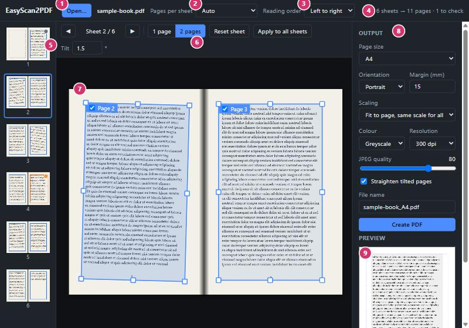
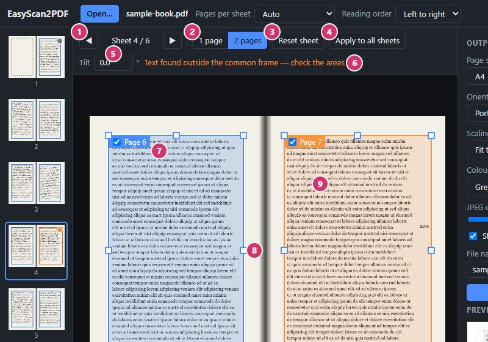
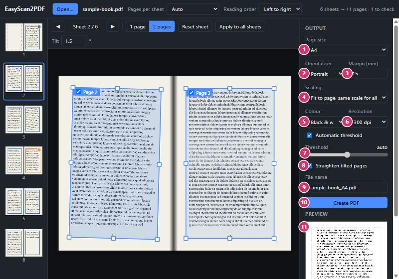
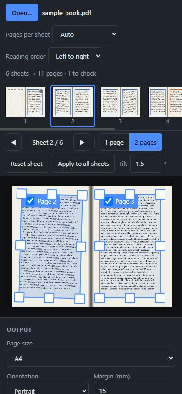

# EasyScan2PDF

Turn scanned documents — typically two book pages per landscape sheet — into a
clean PDF with one page per sheet (A4 by default).

## ▶ [Open EasyScan2PDF](https://jesusjballesteros.github.io/EasyScan2PDF/)

Nothing to download or set up: the link opens the app in your browser.

**Your documents stay on your device.** The app works entirely inside the
browser, makes no network requests with your files, and keeps working offline.

## Install it as an app

Installing gives EasyScan2PDF its own window and icon, and lets it run without
an internet connection.

| Device | How |
|---|---|
| **Windows, macOS, Linux** — Chrome, Edge, Brave | Open the link above and press **Install app** at the top right of the app (or the install icon in the address bar). |
| **Android** — Chrome | Open the link, then browser menu **⋮ → Add to Home screen → Install**. |
| **iPhone, iPad** — Safari | Open the link, then **Share → Add to Home Screen**. |
| **Firefox** | Installation is not available; use the app in a tab — it works the same. |

Once installed on a computer you can also right-click a PDF and choose
*Open with → EasyScan2PDF*.

---

# User's manual

## 1. The screen



| # | Part | What it is for |
|---|---|---|
| 1 | **Open…** | Choose a scanned PDF. You can also drop the file anywhere on the window. JPEG and PNG scans work too: select all the images at once and each becomes one sheet, in file-name order. |
| 2 | **Pages per sheet** | How each scanned sheet is divided. *Auto* decides between one page and two pages side by side. Choose *2 (top \| bottom)* for sheets with one page above the other. Changing this re-runs the detection for the whole document. |
| 3 | **Reading order** | *Right to left* puts the right-hand page first, for Arabic, Hebrew or Japanese books. |
| 4 | **Status** | Number of sheets found, number of pages that will be written, and how many sheets need a look. |
| 5 | **Sheets** | Every scanned sheet with its detected areas. Click one to edit it. A dot marks a sheet: **orange** = check it, **grey** = has a blank page, **blue** = adjusted by hand. |
| 6 | **Sheet toolbar** | Tools for the sheet being edited — see section 3. |
| 7 | **Page areas** | One rectangle per output page. What is inside the rectangle is what goes on the page. |
| 8 | **Output** | Format of the PDF to create — see section 4. |
| 9 | **Preview** | The selected page exactly as it will be written. |

## 2. Open a document

Press **Open…** (1) or drop a file on the window. The app examines every sheet
and proposes the page areas by itself:

- it finds where the sheet is divided by looking at **all** sheets together, so
  one unusual sheet (a title page, a picture across the fold) does not spoil the
  split;
- it gives all left pages and all right pages the same frame, so the text sits
  at the same place and the same size on every output page;
- it skips blank pages and measures how much each page is tilted.

For most documents there is nothing more to do: go to section 4.

## 3. Check and adjust the areas



| # | Control | What it does |
|---|---|---|
| 1 | **◀ ▶** | Previous and next sheet. The keyboard arrows **←** **→** do the same. |
| 2 | **1 page / 2 pages** | Changes how *this* sheet is divided — for example a cover scanned alone in a book of double pages. |
| 3 | **Reset sheet** | Discards your changes on this sheet and restores the automatic areas. |
| 4 | **Apply to all sheets** | Copies the areas of this sheet to every other sheet. Useful when you prefer to set the frame once by hand. Pages that were skipped stay skipped. |
| 5 | **Tilt** | Angle of the selected page, in degrees clockwise. It is measured automatically; type a value to correct it. The rectangle turns to match, and the page comes out straight. |
| 6 | **Notice** | Tells you why a sheet is marked: text was found outside the common frame, or a blank page was skipped. |
| 7 | **Page label** | The page number in the output. Untick the box to leave this page out; the label then reads *Skipped*. |
| 8 | **Handles** | Drag a handle to resize the area. Drag inside the rectangle to move it. |
| 9 | **Orange area** | Something was found outside the frame shared by the other pages (here, a note in the margin). The area was enlarged to include it — shrink it back if it is only a stain. |

Click a rectangle to select it: the preview and the **Tilt** box then refer to
that page.

## 4. Choose the output and create the PDF



| # | Setting | Meaning |
|---|---|---|
| 1 | **Page size** | A4, A5, A3, B5, Letter, Legal, or *Custom…* to type a width and height in millimetres. |
| 2 | **Orientation** | Portrait or landscape. |
| 3 | **Margin** | Minimum white border around the text, in millimetres. The dashed line in the preview shows it. |
| 4 | **Scaling** | *Fit to page, same scale for all* keeps the text the same size on every page (recommended). *Fit each page separately* enlarges each page as much as possible. *Original size* keeps the size of the scan. |
| 5 | **Colour** | *Black & white* gives the smallest files and the crispest text. *Greyscale* suits pencil notes and photographs. *Colour* keeps everything. |
| 6 | **Resolution** | Dots per inch of the output. 300 dpi is a good default; going above the resolution of the original scan adds size but no detail. |
| 7 | **Threshold** | Black & white only. Leave *Automatic threshold* ticked, or untick it and move the slider: right makes the text heavier, left makes it lighter. Greyscale and colour show a **JPEG quality** slider here instead. |
| 8 | **Straighten tilted pages** | Turns each page by its tilt so the lines come out level. Untick to keep pages as scanned. |
| 9 | **File name** | Name of the PDF to create. |
| 10 | **Create PDF** | Writes the document. Chrome, Edge and Brave ask where to save it; other browsers put it in the Downloads folder. **Cancel** stops a long export. |
| 11 | **Preview** | Updates as you change the settings. |

Your output settings are remembered for next time.

## 5. On a phone or tablet



The layout adapts to the screen. On a narrow screen the sheets become a strip
you swipe sideways, and the output settings and preview follow below the sheet.
Handles are larger so the areas can be adjusted with a finger.

## Tips and limits

- **Text cut off on a few pages?** Open those sheets and widen their areas, or
  set one sheet by hand and use *Apply to all sheets*.
- **Wrong split on every sheet?** Pick *Pages per sheet* by hand instead of
  *Auto*.
- Password-protected PDFs cannot be opened.
- The output contains images of the pages; it does not add searchable text (no OCR).

---

## For developers

The app is a static page with no build step.

```
index.html             the app
manifest.webmanifest   install information
sw.js                  offline cache (app files only)
src/detect.js          page-area and tilt detection (no DOM)
src/app.js             UI, preview and PDF export
src/style.css
icons/
vendor/                pdf.js 3.11.174 (Apache-2.0), pdf-lib 1.17.1 (MIT)
docs/img/              manual screenshots
scans/, formatted/     personal documents — git-ignored
```

**Publish:** push the repository to GitHub, then *Settings → Pages → Deploy from
a branch → `main` / root*. The app is served at
`https://jesusjballesteros.github.io/EasyScan2PDF/`. After changing app files,
bump `CACHE` in `sw.js` so installed copies drop their old cache.

**Run locally:** double-click `index.html`, or, to test installation and offline
use, serve the folder:

```bash
python -m http.server 8137 --bind 127.0.0.1
```

## Licence

MIT — see [LICENSE](LICENSE). Bundled libraries keep their own licences, in
`vendor/`.
